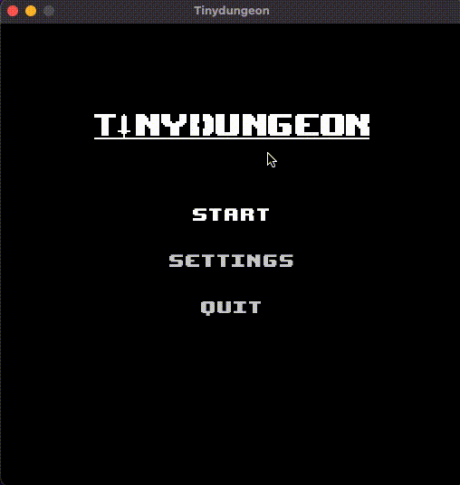
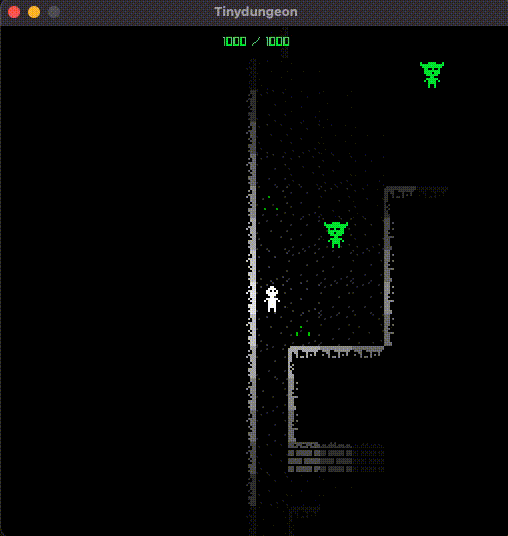

    

A repository for users to report bugs on tiny dungeon and for me to share screenshots   

Tiny Dungeon is a game I am working on in my free time. The game is very _Work In Progress_ and it's not expected to be launched before 2023 ends. It is a 2D top down dungeon crawler rogue-like. It is written in c++ using  [raylib]((https://www.raylib.com/)).

## screenshots 

_Basic attack animation_

_Inventory management_

## Report bugs

If you find a bug please report it in the issues tab. Please include a screenshot of the bug and a description of what you were doing when the bug occured.
